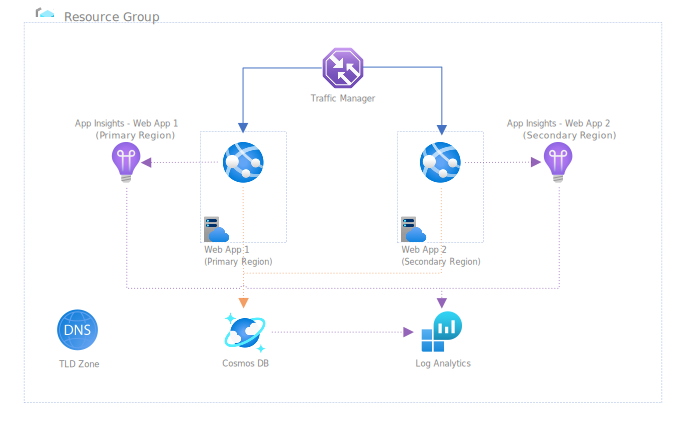

# CGLABS Dashboard PoC #

This repo contains all the required code and configurations required to deploy a functional PoC for demonstrating Azure Managed Grafana Dashboard. It leverages a Multi-Regional API Application running on Azure AppServices behind TrafficManager. It will include everything you need to get up and running including; Bicep Files to deploy Infrastructure, Application Code, Customized Grafana Dashboards, Various Scripts needed to configure things, and GH Workflows for enabling CI/CD deployment (at least to GitHub).

 

You will need to have access to an Azure Environment with OWNER Permissions and a Public Domain you own configure to use Azure DNS. 

 

## Folder Structure ##

| Folder Name           | Description of Contents                                                                                     |
|:----------------------|:------------------------------------------------------------------------------------------------------------|
|.github/workflows      | Contains all the GitHub Action Workflows used to build out the full CI/CD for deploying this Demo in GitHub.|
| code/webTest          | Contains the Sample WebTest used by ApplicationInsights to perform basic GET for Availbility Testing of App |
| code/grafanaDashboard | Contains the pre-built sample Dashboards that will need to be imported into Demo.                           |
| code/scripts          | Contains several scripts that are used to make setting things up easier.                                    |
| code/functionApp      | Cotains the functionApp code that will be deployed to simulate Customer Activity on our DemoApp.            |
| code/demoApp          | Source Code for our .net API Driven DemoApp that we will use for our Dashboards.                            |
| docs/*                | This Folder contains all the MD Files with instructions on how to deploy/configure the Demo Environment.    |
| infra/*               | Contains all Bicep Files that will be leveraged in deploying the Demo Environment.                          |

 

## What will be Deployed ##

 

<!-- markdownlint-disable MD033 -->

 

## How to Get Started ##

 
Getting started using this Demo is pretty straigh-forward. You would start by Forking this Repo to your own GitHub account and then cloning it down to your local system. If you want to setup the full CICD experience, check out the documentation under /docs/github.md for help getting that all setup. 

 

If you plan to just run this locally, you want to make sure you follow the instructions found in /docs/runlocally.md on how to make sure your local workstation is setup to deploy everything. 

 

 

### Current Status of Repo ###

Pending.... Still under development

Steps Needed to Make things work:
-   deployInfrastructure
    -   Update main.params.json
    -   Explain Grafana Admin Requirement (and how to get it)
    -   Walk through running deployInfrastructure.ps1 script.
-   Document "Workstation Setup" <-- Keep it simple what software to install | SDK, GIT, AZ Powershell, AZ CLI -->
-   Download ProfileSettingsFile from AppServices
    -   Document Adding to Variables for Repo
    -   Docuemnt using to deployApp
-   Build AppLication and Send to AppServices
    -   Document Build Process
    -   Document Copy Process