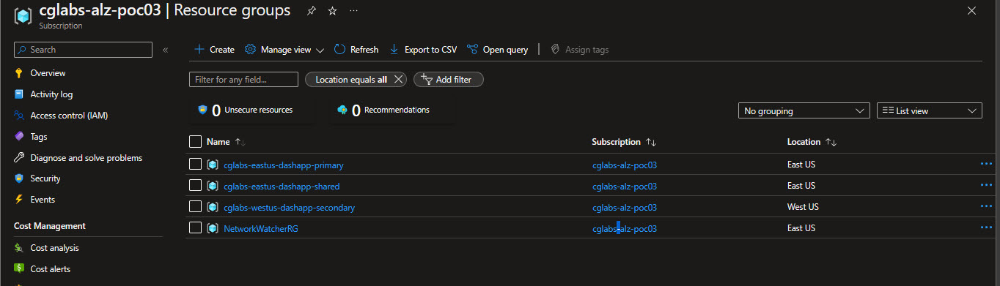

# Resources Deployed for PoC #

<br />

Resources deployed via Bicep Files

Deployment of 3 Resource Groups
|Example Name                     | ResourceType            | Notes                                               |
|:--------------------------------|:------------------------|:----------------------------------------------------|
|cglabs-eastus-dashapp-shared     | ResourceGroup           | Shared Services ResGroup                            |
|cglabs-eastus-dashapp-primary    | ResourceGroup           | Primary Application Resources (Primary Region)      |
|cglabs-westus-dashapp-secondary  | ResourceGroup           | Secondary Application Resources (Secondary Region)  |

<br />

cglabs-eastus-dashapp-shared 
|Example Name                | ResourceType            | Notes                                               |
|:---------------------------|:------------------------|:----------------------------------------------------|
|cglabslogsstorage           | StorageAccount v2       | This will be used for storing Billing Logs          |
|cglabs-dashdemo-law         | LogAnalytics Workspace  | This will be the default LAW for all resources      |
|cglabs-dashdemo-grafana     | Azure Managed Grafana   | This one should be obvious                          |
|cglabs-dashdemo-cosmodb     | Azure CosmoDB           | This will be the backend datasource for WebApp      |
|cglabs-dashdemo-tm          | TrafficManager          | Acts as L4 Global LoadBalancer for BackEnd App      |
|cglabs-dashdemo-func        | FunctionApp             | Generates Fake Activity on App (simulate real-world)|

<br />

cglabs-eastus-dashapp-primary
|Example Name                  | ResourceType            | Notes                                               |
|:-----------------------------|:------------------------|:----------------------------------------------------|
|cglabs-eastus-dashdemo-asp    | App Server Plan         | Underlying Infrastructure for App Services          |
|cglabs-eastus-dashdemo-web    | App Services            | Hosts our API/WebApp                                |
|cglabs-eastus-dashdemo-ai     | ApplicationInsights     | Captures telemtry on WebApp for Logging             |
|cglabs-eastus-dashdemo-webtest| AI WebTest              | Test Availability of Application for Logging        |

<br />

cglabs-westus-dashapp-secondary
|Example Name                  | ResourceType            | Notes                                               |
|:-----------------------------|:------------------------|:----------------------------------------------------|
|cglabs-westus-dashdemo-asp    | App Server Plan         | Underlying Infrastructure for App Services          |
|cglabs-westus-dashdemo-web    | App Services            | Hosts our API/WebApp                                |
|cglabs-westus-dashdemo-ai     | ApplicationInsights     | Captures telemtry on WebApp for Logging             |
|cglabs-westus-dashdemo-webtest| AI WebTest              | Test Availability of Application for Logging        |

<br />
<hr />

## DemoApp Diagram ##

<!-- markdownlint-disable MD033 -->
<div style="padding:20px;text-align:center;">

</div>

<br />
<hr>
<br />

## Step 1: Update Parameters ##

Update existing main.params.json file with your information. 

<br />

```json
{
  "$schema": "https://schema.management.azure.com/schemas/2019-04-01/deploymentParameters.json#",
  "contentVersion": "1.0.0.0",
  "parameters": {
    "primaryRegion": {
      "value": "eastus"
    },
    "secondaryRegion": {
      "value": "westus"
    },
    "resourcePrefix": {
      "value": "cglabs"
    },
    "demoAppName": {
      "value": "dashapp"
    },
    "dnsObject": {
      "value": {
        "name": "cglabs.work",
        "resGroup": "cglabs-core-dns",
        "subscriptionId": "be885fcb-091a-41fe-ad69-5eea915d1211"
      }
    },
    "resourceTags": {
      "value": {
        "Environment": "PoC",
        "Project": "Managed Grafana Demo",
      }
    }
  }
}
```
<br />

| Parameter               | Notes                                                                                                       |
| :-                      | :-                                                                                                          |
| `primaryRegion`         | Primary region of the application. Use the ShortHand (e.g., "eastus").                                      |
| `secondaryRegion`       | Secondary region of the application. Use the ShortHand (e.g., "westus").                                    |
| `resourcePrefix`        | This will be prefixed to all Azure ResourceGroups and Resources                                             |
| `demoAppName`           | The name you want to give your demo - this will be used naming resources, creating the certificate, and DNS |
| `dnsObject`             | This contains the location of your existing Azure DNS Zone that will be used to set Custom Hostname         |
| `resourceTags`          | This will be appended to ResourceGroups and Resources.                                                      |

<br />

Once you've updated the parameters file and saved it, you are ready to deploy the infrastructure to Azure.

<br />

## Step 2: Deploy Bicep

**NOTE**
: The below steps are only required if you plan to execute locally (please review docs for setting up everything `./docs/runlocally.md` before proceeding.). You could alternatively follow the GitHub Setup doc and use GH Workflows to deploy as well. 

<br />

### PowerShell \ Windows ###

```powershell
$WarningPreference = 'SilentlyContinue'

## Set AzContext to targetted Subscription and set grafanaId
$azContext = $(Set-AzContext -SubscriptionId '197f4130-ef26-4439-a354-eb5a2a2d7f85')
$grafanaId = ($azContext.Account.ExtendedProperties.HomeAccountId.Split('.')[0])

## Deploy Infrastructure
$deployment = New-AzSubscriptionDeployment `
  -Name 'dashboardDemo' `
  -location 'eastus' `
  -TemplateFile './infra/main.bicep' `
  -TemplateParameterFile './infra/main.params.json' `
  -deployedBy $(whoami) `
  -grafanaAADId $grafanaId
```

<br />

 > **IMPORTANT: A sample Powershell Script with above code is located under `./code/scripts/deployMain.ps1`**

<br />

### Azure CLI \ Bash ###

```bash
# Login to Azure CLI
az login

# Set AzContext to targetted Subscription 
az account set --subscription 'REPLACE WITH SUBSCRIPTION ID'

# Deploy Infrastructure (Be sure to capture the output json - it'll be needed for later!)
az deployment sub create --location 'eastus' --template-file ./infra/main.bicep --parameters ./main.params.json --parameters deployedBy=$(whoami)
```
  
<br />

### Output ###
> **IMPORTANT: The script may take 5-10 minutes to complete, depending on how long it takes to deploy Upon completion, the script will output JSON with the configured resources and their information..**

<br />

Eventually you will see the following ResourceGroups (names will be differnt) show up under your subscription. 

<!-- markdownlint-disable MD033 -->
<div style="padding:20px;text-align:center;">

</div>